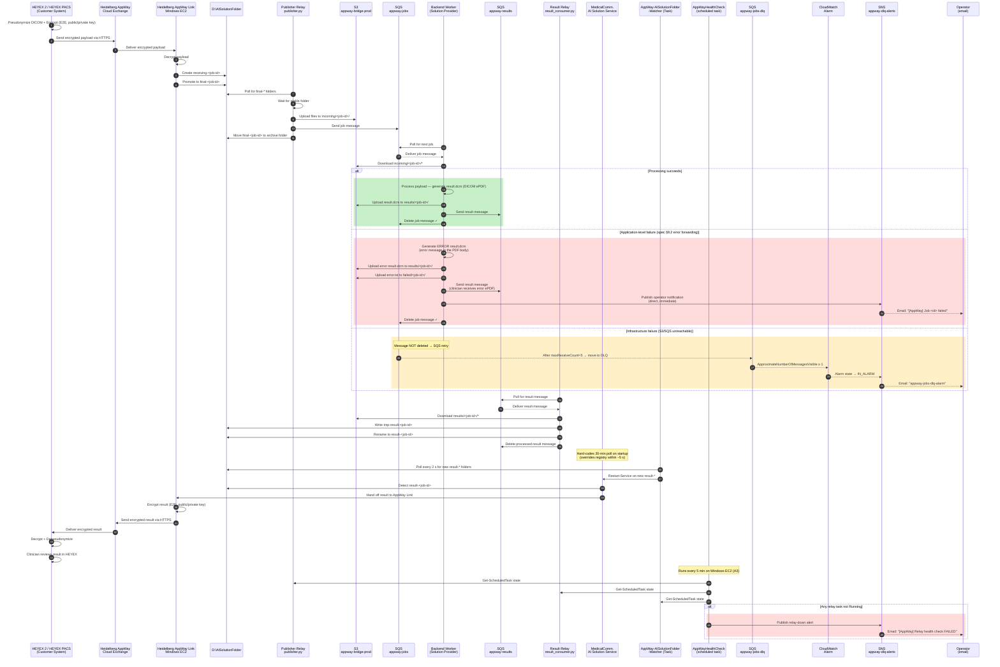

# Heidelberg AppWay Full Sequence Diagram

End-to-end sequence for a single job, matching the official Heidelberg AppWay Functional Diagram (`main.jpeg`). Covers the customer system, Cloud Exchange, AppWay Link (with encryption/decryption), the bridge relays, the backend worker, and the three-layer operator alerting (direct SNS publish from the backend, CloudWatch DLQ alarms, and the AppWay-side `AppWayHealthCheck` scheduled task).

## Legend

- **External** — HEYEX 2 / HEYEX PACS on the customer side; handles pseudonymization, encryption on send, decryption + depseudonymization on receive.
- **Cloud** — Heidelberg AppWay Cloud Exchange; transport-only, sees only encrypted payloads.
- **AppWay** — Heidelberg AppWay Link running on our Windows EC2; decrypts inbound payloads and encrypts outbound results. Owns `D:\AISolutionFolder`.
- **Publisher / Consumer** — our two bridge relays on the Windows EC2 (`appway_bridge/publisher.py` and `appway_bridge/result_consumer.py`).
- **Backend** — our Linux EC2 worker (the "Solution Provider" in the official diagram); performs the analysis and produces `result.dcm` (DICOM Encapsulated PDF).
- **AISvc** — `MedicalCommunications AI Solution Service` inside AppWay Link. Responsible for polling `D:\AISolutionFolder` for `result-*` folders and handing them off to the AppWay Link outbound path for encryption. Hard-codes `ServiceAISolutionAutomaticCheckSleepTimeInMinutes=20` on every startup (overrides any registry edit within ~5 s), causing a ~20-min pickup delay unless the watcher is running.
- **Watcher** — `AppWay-AISolutionFolder-Watcher` scheduled task on the Windows EC2 (source: `scripts/appway-windows/install_ai_solution_watcher.ps1`). Polls `D:\AISolutionFolder` every 2 s; when it detects a new `result-*` folder it issues `Restart-Service "MedicalCommunications AI Solution Service"`, forcing the service to pick up the result immediately. Reduces Δ_appway (stage [7]→[8]) from ~20 min to ~29 s. Monitored by `AppWayHealthCheck`.
- **HealthCheck** — `AppWayHealthCheck` scheduled task on the Windows EC2 (`scripts/appway-windows/healthcheck.ps1`, deployed to `C:\AppWayBridge\bin\healthcheck.ps1`). Runs every 5 minutes as SYSTEM, checks that `AppWayBridgePublisher`, `AppWayBridgeResultConsumer`, and `AppWay-AISolutionFolder-Watcher` are all in the `Running` state, and publishes an operator alert to SNS when any is not.
- **S3 / Jobs / Results** — AWS infrastructure used as the in-cloud handoff between the Windows side and the Linux worker.
- **DLQ** — `appway-jobs-dlq`, reserved for infrastructure failures only (not application errors). A symmetric `appway-results-dlq` protects the return leg (result consumer on the Windows EC2).
- **CW** — CloudWatch Alarms `appway-jobs-dlq-alarm` and `appway-results-dlq-alarm`: each fires when its DLQ depth ≥ 1.
- **SNS** — SNS topic `appway-dlq-alerts` subscribed by operator email; receives direct worker-side publishes (fast, application errors), CloudWatch alarm actions (slow, infrastructure errors), and `AppWayHealthCheck` publishes (relay death on the Windows EC2).
- **Ops** — on-call operator email subscription on the SNS topic.

## Three-layer alerting

| Layer | Trigger | Path | Use case |
|-------|---------|------|----------|
| **Fast (backend)** | `Backend → SNS → Ops` | Direct `sns:Publish` from worker `except` block | Application errors: bad DICOM, analysis crash, unexpected exception. Clinician still gets an error ePDF. |
| **Slow (DLQ)** | `Backend ↛ SQS → DLQ → CW → SNS → Ops` | CloudWatch alarm on DLQ depth | Infrastructure failures on the backend path: S3/SQS unreachable, IAM revoked, persistent network problems. Worker retries via SQS, then DLQ fires the alarm. Symmetric alarm on `appway-results-dlq` protects the return leg. |
| **Relay-death (AppWay side)** | `HealthCheck → SNS → Ops` | Every 5 min: `AppWayHealthCheck` scheduled task checks `AppWayBridgePublisher` and `AppWayBridgeResultConsumer` state; publishes if either ≠ `Running`. | Permanent death of a relay scheduled task (Python crash loop, configuration error, manual stop). Without this, the backend would sit idle with no failing DICOM to retry and nothing to populate the DLQ. |

All three layers publish to the same SNS topic (`appway-dlq-alerts`), so operators receive a single, consistent email notification channel.
